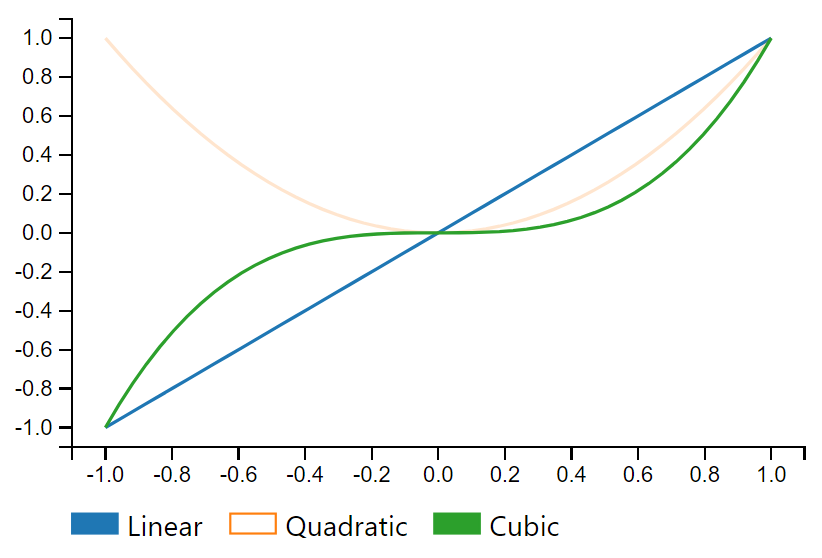
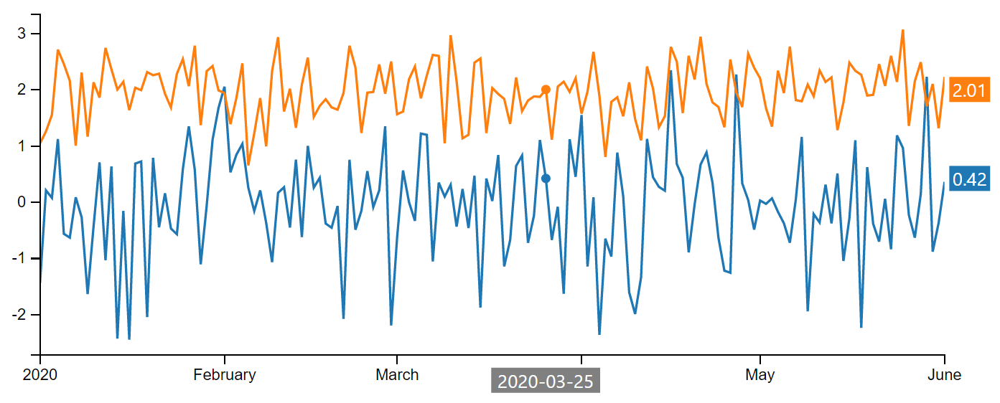

# mpld3 Plugins

This directory contains a collection of [mpld3](https://mpld3.github.io/) plugins that can be used to extend the interactive behaviour of plots created using [matplotlib](http://www.matplotlib.org/). Plots created with mpld3 rely on [D3js](https://d3js.org/), thus can only be used within the browser, standard web pages or tools such as the [Jupyter notebook](https://jupyter.org/).

Together these plugins form one of the three components that make up the [JupyterLab Autoplot extension](../README.md).

- [Usage](#usage)
- [List of plugins](#list-of-plugins)
  - [Interactive Legend](#interactive-legend)
  - [Range Selector Buttons](#range-selector-buttons)
  - [Time Series Tooltip](#time-series-tooltip)
  - [Save Image Buttons](#save-image-buttons)
- [Development](#development)
  - [A note about types](#a-note-about-types)

## Usage

Each plugin extends `mpld3.plugins.PluginBase`, and can be connected to an mpld3 figure using `mpld3.plugins.connect(fig, <instance>)`. Please see the examples below for more information (note that the following needs to be run first in each case):

```py
import numpy as np
import pandas as pd

import matplotlib.pyplot as plt
import mpld3

%matplotlib inline
mpld3.enable_notebook()
```

## List of plugins

### Interactive Legend

Adds an interactive legend below the figure. Each legend item can be clicked to show/hide the associated line. This plugin communicates with the Time Series Tooltip plugin and the Range Selector Buttons plugin, but can be used independently.

```py
fig, ax = plt.subplots()
fig.subplots_adjust(bottom=0.15)

x = np.linspace(-1, 1)
lines = [ax.plot(x, x), ax.plot(x, x**2), ax.plot(x, x**3)]
labels = ["Linear", "Quadratic", "Cubic"]

mpld3.plugins.connect(fig, InteractiveLegend(lines, labels))
plt.show()
```

<p align="center">
    
</p>

### Range Selector Buttons

Adds range selector buttons to a time series plot. This plugin communicates with the Interactive Legend plugin, but can be used independently.

```py
fig, ax = plt.subplots(figsize=(10, 4))

x = pd.date_range("2020-01-01", "2021-06-01")
y = np.random.randn(len(x))

lines = [ax.plot(x, y)]
button_labels = ["fit", "reset", "5d", "14d", "1m", "6m", "ytd", "1y"]

ax.autoscale(enable=True, axis="x", tight=True)
mpld3.plugins.connect(fig, RangeSelectorButtons(button_labels, lines))

plt.show()
```

<p align="center">
    
</p>

### Time Series Tooltip

Adds hover information to time series plots. The graph can be clicked or dragged to update the location of the tooltips.

This plugin communicates with the Interactive Legend plugin, but can be used independently.

```py
fig, ax = plt.subplots(figsize=(10, 4))
fig.subplots_adjust(left=0.05, right=0.85)

x = pd.date_range("2020-01-01", "2020-06-01")
y1 = np.random.randn(len(x))
y2 = np.random.randn(len(x)) / 2 + 2

lines = [ax.plot(x, y1), ax.plot(x, y2)]

ax.autoscale(enable=True, axis="x", tight=True)
mpld3.plugins.connect(fig, TimeSeriesTooltip(lines))

plt.show()
```

<p align="center">
    
</p>

### Save Image Buttons

Adds buttons to save the plot the plot as an image. Currently, this plugin must be used alongside the JupyterLab Autoplot extension, although could be easily modified to work independently.

## Development

```sh
# clone the repo
git clone https://github.com/man-group/jupyterlab-autoplot.git

# navigate to the plugins' directory
cd jupyterlab-autoplot/mpld3-plugins

# install node modules
npm install

# build and bundle the JavaScript
npm run build

# copy the bundled files to 'ipython-extension/autoplot/plugins/bundles'
npm run copy
```

### A note about types

The mpld3 library does not support TypeScript, however some type declarations for it were defined in this project to aid development. These declaration files are not comprehensive and in some cases may be inaccurate, thus should be used with caution.
